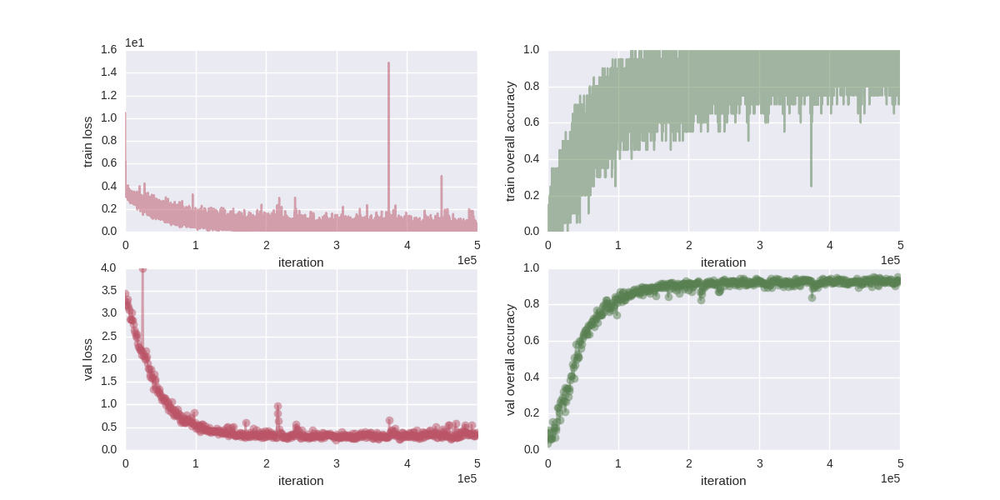

vgg16
=====

VGG16 net for object recognition with chainer implementation.

Examples
--------

Amazon Picking Challenge 2015
+++++++++++++++++++++++++++++

- `Example directory <examples/apc2015>`_

It ends with ``95.13 %`` accuracy with transformation in train images.
With BoF, the accuracy was ``52.44 %``.

**With transformation**

**Without transformation**

.. image:: examples/apc2015/2016-05-18-00-11-39.png
